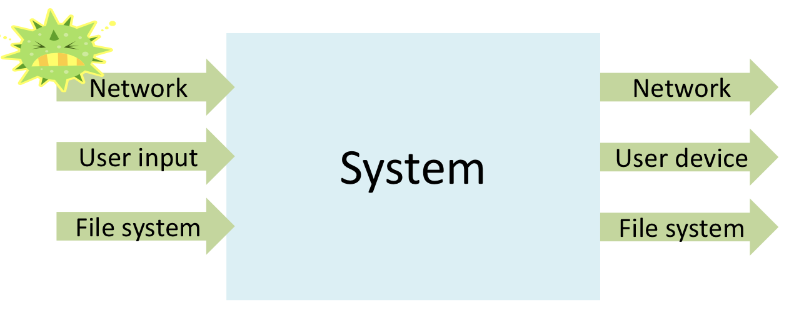
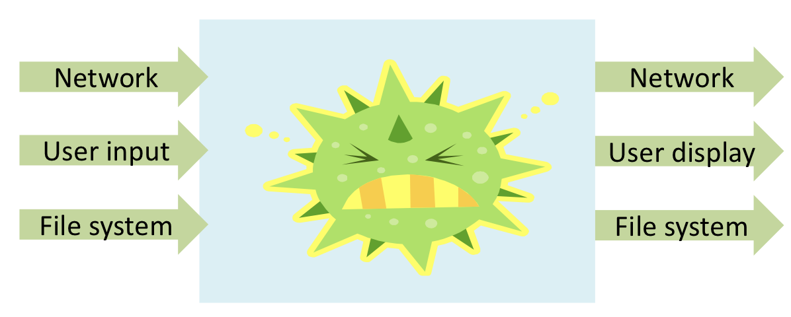
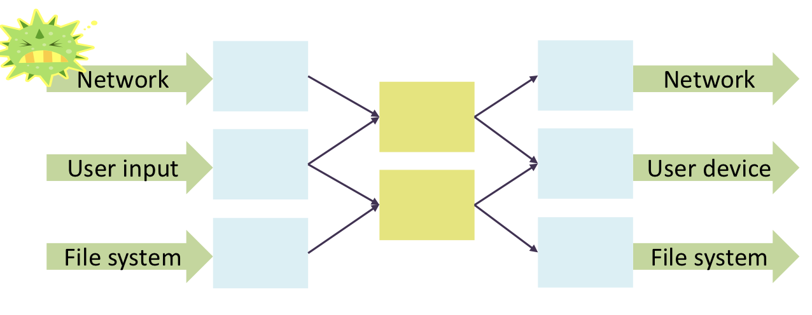
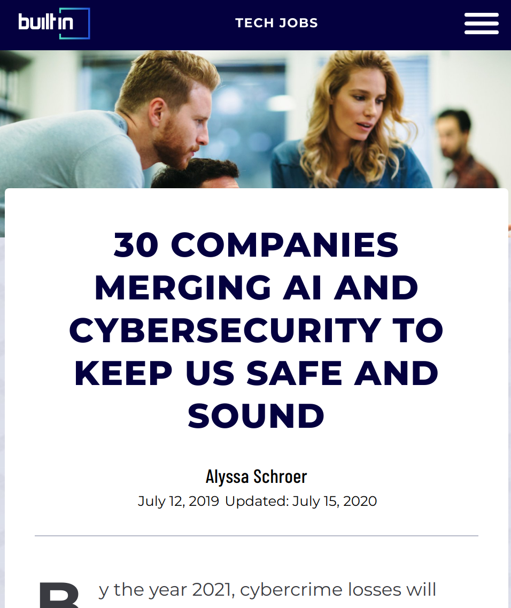
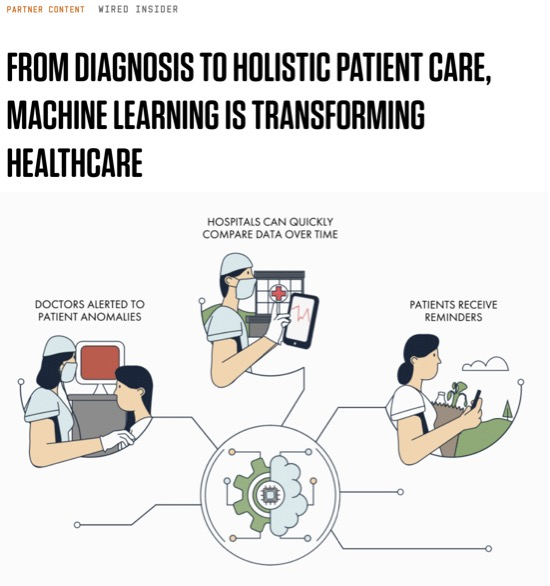
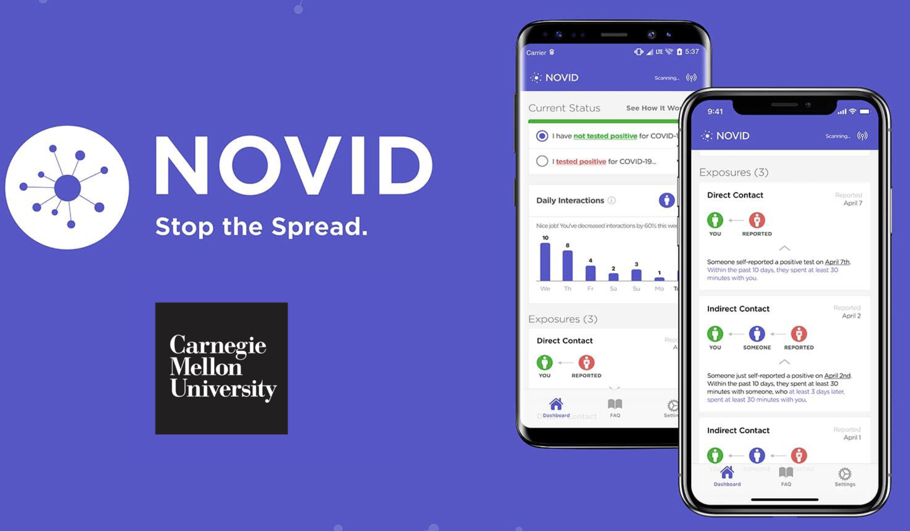
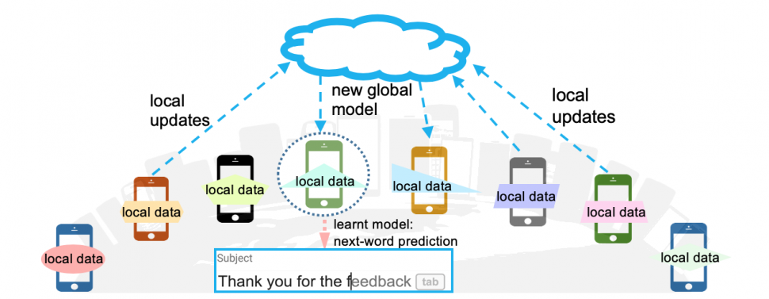

<!-- .element: class="titleslide"  data-background="../_chapterimg/21_security.jpg" -->

## Machine Learning in Production

# Security and Privacy

<!-- img: https://pixabay.com/photos/castles-padlocks-love-lock-love-505878/ -->

---
## More responsible engineering...

<!-- .element: class="plain stretch" -->

----
## Readings

* _Building Intelligent Systems: A Guide to Machine Learning Engineering_, G. Hulten (2018), Chapter 25: Adversaries and Abuse.
*	_The Top 10 Risks of Machine Learning Security_, G. McGraw et al., IEEE Computer (2020).

----
## Learning Goals

* Explain key concerns in security (in general and with regard to ML models)
* Identify security requirements with threat modeling
* Analyze a system with regard to attacker goals, attack surface, attacker capabilities
* Describe common attacks against ML models, including poisoning and evasion attacks
* Understand design opportunities to address security threats at the system level
* Apply key design principles for secure system design

---
# Security – Why do we care?

----

<!-- .element: class="stretch" -->

<!-- references_ -->
Source: ABC news, Oct 12, 2014

----

<!-- .element: class="stretch" -->

Colonial Pipeline attack, 2021

----

<!-- .element: class="stretch" -->

<!-- references_ -->
Source: Wired, Feb 8, 2021

----

<!-- .element: class="stretch" -->

<!-- references_ -->
Source: Wall Street Journal, Sept 30, 2021

----
## Security: Why do we care?

Security is expensive
- Additional development cost; need security expertise in your team/organization
- Annoys and interferes with the user's work (e.g., two-factor authentication)
- Not really regulated/enforced by law
- Often retroactively added after an incident, to avoid embarrassment, lawsuits,
  fines (sometimes)

----
## Security: Why do we care?

But increasingly wider range of harms caused by security attacks
- Not just data leaks anymore
- Can cause **safety** failures; physical, environmental, mental harms
- Viewpoint: We can't all be security experts, but:
  - should be aware of possible consequences of no/little security
  - understand basic principles; avoid common pitfalls
  - know how to apply best practices
  - know how to talk to security experts

 Recall: T-shaped people!

---
# Security – A (Very Brief) Overview

----
## Elements of Security

Security requirements (also called "policies")
* What does it mean for my system to be secure?

Threat model
* What are the attacker's goals, capabilities, and incentives?

Attack surface
* Which parts of the system are exposed to the attacker?

Defense mechanisms (mitigiations)
* How do we prevent attacker from compromising a security req.?

----
## Security Requirements

<!-- .element: class="plain" -->

*What do we mean by "secure"?*

----
## Security Requirements

Common security requirements: "CIA triad" of information security

__Confidentiality__: Sensitive data must be accessed by authorized users only

__Integrity__: Sensitive data must be modifiable by authorized users only

__Availability__: Critical services must be available when needed by clients

----
## Example: College Admission System

----
## Confidentiality, integrity, or availability?

* Applications to the program can only be viewed by staff and faculty
in the department.
* The application site should be able to handle requests on the
day of the application deadline.
* Application decisions are recorded only by the faculty and staff.
* The acceptance notices can only be sent out by the program director.

----
## Other Security Requirements

**Authentication:** Users are who they say they are

**Non-repudiation:** Certain changes/actions in the system can be traced to who was responsible for it

**Authorization:** Only users with the right permissions can access a resource/perform an action

---
# ML-Specific Threats

----
## What's new/special about ML?

<!-- discussion -->

----
## Where to worry about security?

<!-- .element: class="stretch" -->

<!-- references_ -->
From: McGraw, G. et al. "An architectural risk analysis of machine learning systems: Toward more secure machine learning." Berryville Inst. ML (2020).

----
## ML-Specific Concerns

Who can access/influence...
* training data
* labeling
* inference data
* models, pipeline code
* telemetry
* ...

----
## Goals behind ML-Specific Attacks

**Confidentiality attacks:** Exposure of sensitive data
  * Infer a sensitive label for a data point (e.g., hospital record)

**Integrity attacks:** Unauthorized modification of data
  * Induce a model to misclassify data points from one class to another (e.g., spam filter)

**Availability attacks:** Disruption to critical services
  * Reduce the accuracy of a model (e.g., induce model to misclassify many data points)

----
## Overview of Discussed ML-Specific Attacks

* Evasion attacks/adversarial examples (integrity violation)
* Targeted poisoning attacks (integrity violation)
* Untargeted poisoning attacks (availability violation)
* Model stealing attacks (confidentiality violation against model data)
* Model inversion attack (confidentiality violation against training data)

----
## Evasion Attacks (Adversarial Examples)

<!-- .element: class="stretch" -->

Attack at inference time
* Add noise to an existing sample & cause misclassification
* Possible with and without access to model internals
* **Q. Other examples?**

<!-- references_ -->
_Accessorize to a Crime: Real and Stealthy Attacks on State-of-the-Art
Face Recognition_, Sharif et al. (2016).

----
## Evasion Attacks: Another Example

<!-- .element: class="stretch" -->

<!-- references_ -->
_Robust Physical-World Attacks on Deep Learning Visual
Classification_,
Eykholt et al., in CVPR (2018).

----
## Task Decision Boundary vs Model Boundary

<!-- .element: class="stretch" -->

<!-- references_ -->
From Goodfellow et al (2018). [Making machine learning robust against adversarial inputs](https://par.nsf.gov/servlets/purl/10111674). *Communications of the ACM*, *61*(7), 56-66.

Note:
Exploiting inaccurate model boundary and shortcuts

* Decision boundary: Ground truth; often unknown and not specifiable
* Model boundary: What is learned; an _approximation_ of
decision boundary

----
## Defense against Evasion Attacks

<!-- discussion -->

__How would you mitigate evasion attacks?__

----
## Defense against Evasion Attacks

Redundancy: Design multiple mechanisms to detect an attack
* Here: Insert a barcode as a checksum; harder to bypass

<!-- references -->
_Reliable Smart Road Signs_, Sayin et al. (2019).

----
## Defense against Evasion Attacks

Redundancy: Design multiple mechanisms to detect an attack

Adversarial training
  * Improve decision boundary, robustness
  * Generate/find a set of adversarial examples
  * Re-train your model with correct labels

Input sanitization
  * "Clean" & remove noise from input samples
  * e.g., Color depth reduction, spatial smoothing, JPEG compression

----
## Generating Adversarial Examples

<!-- discussion -->

**How do we generate adversarial examples?**

----
## Generating Adversarial Examples

* See [counterfactual explanations](https://ckaestne.github.io/seai/F2020/slides/17_explainability/explainability.html#/7/1)
* Find small change to input that changes prediction
  - $x^* = x + arg min \\{ |\epsilon| : f(x+\epsilon)  \neq f(x) \\}$
  * Many similarity/distance measures for $|\epsilon|$ (e.g., change one feature vs small changes to many features)
* Attacks more effective with access to model internals, but black-box
  attacks also feasible
  - With model internals: Follow the model's gradient
  - Without model internals: Learn [surrogate model](https://ckaestne.github.io/seai/F2020/slides/17_explainability/explainability.html#/6/2)
  - With access to confidence scores: Heuristic search (e.g., hill climbing)

----
## Untargeted Poisoning Attack on Availability

<!-- colstart -->

Inject mislabeled training data to damage model quality
  * 3% poisoning => 11% decrease in accuracy (Steinhardt, 2017)

Attacker must have some access to the public or private training set

**Q. Other examples?**

<!-- col -->

*Example: Anti-virus (AV) scanner: AV company (allegedly) poisoned competitor's model by submitting fake viruses*

<!-- colend -->

----
## Targeted Poisoning Attacks on Integrity

Insert training data with seemingly correct labels

<!-- .element: class="stretch" -->

More targeted than availability attack, cause specific misclassification

<!-- references_ -->
_Poison Frogs! Targeted Clean-Label Poisoning Attacks on Neural
Networks_, Shafahi et al. (2018)

----
## Defense against Poisoning Attacks

<!-- discussion -->

__How would you mitigate poisoning attacks?__

----
## Defense against Poisoning Attacks

Anomaly detection & data sanitization
----
## Defense against Poisoning Attacks

Anomaly detection & data sanitization
  * Identify and remove outliers in training set (see [data quality lecture](https://ckaestne.github.io/seai/F2020/slides/11_dataquality/dataquality.html#/3))
  * Identify and understand drift from telemetry

Quality control over your training data
  * Who can modify or add to my training set? Do I trust the data
  source? *Model data flows and trust boundaries!*
  * Use security mechanisms (e.g., authentication) and logging to
    track data provenance

<!-- references -->
_Stronger Data Poisoning Attacks Break Data Sanitization Defenses_,
Koh, Steinhardt, and Liang (2018).

----
## Model Stealing Attacks

<!-- .element: class="stretch" -->

<!-- references_ -->
Singel. [Google Catches Bing Copying; Microsoft Says 'So What?'](https://www.wired.com/2011/02/bing-copies-google/). Wired 2011.

----
## Model Stealing Attacks

Copy a model without direct access

-> Query model repeatedly and build surrogate model

**Defenses?**

----
## Defending against Model Stealing Attacks

Use model internally

Rate limit API

Abuse detection

Inject artificial noise (vs. accuracy)

----
## Model Inversion against Confidentiality

<!-- colstart -->

Given a model output (e.g., name of a person), infer the
corresponding, potentially sensitive input (facial image of the
person)
* e.g., exploit model confidence values & search over input space

<!-- col -->

<!-- colend -->

<!-- references -->
_Model Inversion Attacks that Exploit Confidence Information and Basic
Countermeasures_, M. Fredrikson et al. in CCS (2015).

----
## Defense against Model Inversion Attacks

More noise => higher privacy, but also lower model accuracy!

----
## Defense against Model Inversion Attacks

Limit attacker access to confidence scores
* e.g., reduce the precision of the scores by rounding them off
* But also reduces the utility of legitimate use of these scores!

Differential privacy in ML
* Limit what attacker can learn about the model (e.g., parameters)
    based on an individual training sample
* Achieved by adding noise to input or output (e.g., DP-SGD)
* More noise => higher privacy, but also lower model accuracy!

<!-- references -->
_Biscotti: A Ledger for Private and Secure Peer-to-Peer Machine
Learning_, M. Shayan et al., arXiv:1811.09904 (2018).

----
## Review: ML-Specific Attacks

* Evasion attacks/adversarial examples (integrity violation)
* Targeted poisoning attacks (integrity violation)
* Untargeted poisoning attacks (availability violation)
* Model stealing attacks (confidentiality violation against model data)
* Model inversion attack (confidentiality violation against training data)

----
## Breakout: Dashcam System

<!-- colstart -->

Recall: Dashcam system from I2/I3

As a group, tagging members, post in `#lecture`:
  * Security requirements
  * Possible (ML) attacks on the system
  * Possible mitigations against these attacks

<!-- col -->

<!-- colend -->

----
## State of ML Security

<!-- .element: style="width:1200px" -->

----
## State of ML Security

On-going arms race (mostly among researchers)
  * Defenses proposed & quickly broken by noble attacks

Assume ML component is likely vulnerable
  * Design your system to minimize impact of an attack

Focus on protecting training and inference data access

Remember: There may be easier ways to compromise system
  * e.g., poor security misconfiguration (default password), lack of
    encryption, code vulnerabilities, etc.,

---
# Threat Modeling

----
## Why Threat Model?

----
## Threat model: A profile of an attacker

* __Goal__: What is the attacker trying to achieve?
* __Capability__:
  * Knowledge: What does the attacker know?
  * Actions: What can the attacker do?
  * Resources: How much effort can it spend?
* __Incentive__: Why does the attacker want to do this?

----
## Attacker Goal

What is the attacker trying to achieve?
* Typically, undermine security requirements (recall C.I.A)

Example: College admission
* Access other applicants info without being authorized (C)
* Modify application status to “accepted” (I)
* Modify admissions model to reject certain applications (I)
* Cause website shutdown to sabotage other applicants (A)

----
## Attacker Capability

<!-- .element: class="stretch" -->

What actions are available to the attacker (to achieve its goal)?
 * Depends on system boundary/interfaces exposed to external actors
 * Use an architecture diagram to identify attack surface & actions

<!-- ---- -->
<!-- ## Architecture Diagram for Threat Modeling -->

<!--  -->

<!-- * You can use any notation, as long as: -->
<!--   * its constructs (e.g., boxes and lines) have clear meanings; use legend! -->
<!--   * it clearly shows potentially malicious/untrusted agent(s) & interactions -->
<!--     with the system -->

----
## STRIDE Threat Modeling

<!-- .element: class="stretch" -->

A systematic approach to identifying attacks
* Construct an architectural diagram with components & connections
* Indicate trust boundaries
* For each untrusted connection, enumerate STRIDE threats
* For each potential threat, devise a mitigation strategy

<!-- references_ -->

[More info: STRIDE approach](https://docs.microsoft.com/en-us/archive/msdn-magazine/2006/november/uncover-security-design-flaws-using-the-stride-approach)

----
## STRIDE: College Admission

<!-- .element: class="stretch" -->

* Spoofing: ?
* Tampering: ?
* Information disclosure: ?
* Denial of service: ?

----
## STRIDE: Example Threats

<!-- .element: class="stretch" -->

* Spoofing: Attacker pretends to be another applicant by logging in
* Tampering: Attacker modifies applicant info using browser exploits
* Information disclosure: Attacker intercepts HTTP requests from/to
    server to read applicant info
* Denial of service: Attacker creates a large number of bogus
    accounts and overwhelms system with requests

----
## STRIDE: Example Mitigations

* Spoofing: Attacker pretends to be another applicant by logging in
  * -> __Require two-factor authentication__
* Tampering: Attacker modifies applicant info using browser exploits
  * -> __Add server-side security tokens__
* Information disclosure: Attacker intercepts HTTP requests from/to server to read applicant info
  * -> __Use encryption (HTTPS)__
* Denial of service: Attacker creates many bogus accounts and overwhelms system with requests
  * -> __Limit requests per IP address__

----
## Breakout: Threat Modeling

<!-- colstart -->

Again: Dashcam system from I2/I3

Using STRIDE, discuss & post:
  * Data flow throughout the system
  * Possible attacks on the system

<!-- col -->

<!-- colend -->

----
## STRIDE & Other Threat Modeling Methods

A systematic approach to identifying threats & attacker actions

Limitations:
  * May end up with a long list of threats, not all of them critical
  * False sense of security: STRIDE does not imply completeness!

Consider cost vs. benefit trade-offs
* Implementing mitigations add
    to development cost and complexity
* Focus on most critical/likely threats

---
# Designing for Security

----
## Security Mindset

<!-- .element: class="stretch" -->

* Assume that all components may be compromised eventually
* Don't assume users will behave as expected; assume all inputs to the system as potentially malicious
* Aim for risk minimization, not perfect security

----
## Secure Design Principles

*Minimize the impact of a compromised component*
 * **Principle of least privilege:** A component given only minimal privileges needed to fulfill its functionality
 * **Isolation/compartmentalization:** Components should be able to interact with each other no more than necessary
 * **Zero-trust infrastructure:** Components treat inputs from each other as potentially
  malicious

*Monitoring & detection*
* Identify data drift and unusual activity

----
## Monolithic Design

----
## Monolithic Design

<!-- .element: class="stretch" -->

Flaw in any part  =>  Security impact on  entire system!

----
## Compartmentalized Design

----
## Compartmentalized Design

Flaw in one component =>  Limited impact on the rest of the system!

----
## Example: Vehicle Security

* Research project from UCSD: Remotely taking over vehicle control
  * Create MP3 with malicious code & burn onto CD
  * Play CD => send malicious commands to brakes, engine, locks...
* Problem: Over-privilege & lack of isolation! Shared CAN bus

<!-- .element: class="stretch" -->

<!-- references_ -->
_Comprehensive Experimental Analyses of Automotive Attack Surfaces_, Checkoway et al., in USENIX Security (2011).

----
## Secure Design Principles for ML

<!-- colstart -->

*Principle of least privilege*
* Who has access to training data, model internal, system input &
output, etc.,?
* Does any user/stakeholder have more access than necessary?
* If so, limit access by using authentication mechanisms

<!-- col -->

<!-- .element: class="stretch" -->

<!-- colend -->
----
## Secure Design Principles for ML

<!-- colstart -->

*Isolation & compartmentalization*
* Can a security attack on one ML component (e.g., misclassification)
  adversely affect other parts of the system?
* If so, compartmentalize or build in mechanisms to limit
        impact (see lecture on mitigating mistakes)

<!-- col -->

<!-- .element: class="stretch" -->

<!-- colend -->

----
## Secure Design Principles for ML

<!-- colstart -->

*Monitoring & detection*
  * Look for odd shifts in the dataset and clean the data if needed (for poisoning attacks)
  * Assume all system input as potentially malicious & sanitize
    (evasion attacks)

<!-- col -->

<!-- .element: class="stretch" -->

<!-- colend -->

---
# AI for Security

----

<!-- .element: class="stretch" -->

----
## Many Defense Systems use ML

* Classifiers to learn malicious content: Spam filters, virus detection
* Anomaly detection: Identify unusual/suspicious activity, eg. credit card fraud, intrusion detection
* Game theory: Model attacker costs and reactions, design countermeasures
* Automate incidence response and mitigation activities, DevOps
* Network analysis: Identify bad actors and their communication in public/intelligence data
* Many more, huge commercial interest

<!-- references -->
Recommended reading: Chandola, Varun, Arindam Banerjee, and Vipin Kumar. "[Anomaly detection: A survey](http://cucis.ece.northwestern.edu/projects/DMS/publications/AnomalyDetection.pdf)." ACM computing surveys (CSUR) 41, no. 3 (2009): 1-58.

----
## AI Security Solutions are ML-Enabled Systems Too

ML component one part of a larger system

Consider entire system, from training to telemetry, to user interface, to pipeline automation, to monitoring

ML-based security solutions can be attacked themselves

----

One contributing factor to the Equifax attack was an expired certificate for an intrusion detection system

---
# ML & Data Privacy

----

<!-- .element: class="stretch" -->

> Andew Pole, who heads a 60-person team at Target that studies
customer behavior, boasted at a conference in 2010 about a proprietary
program that could identify women - based on their purchases and
demographic profile - who were pregnant.

<!-- references_ -->
Lipka. "[What Target knows about you](https://www.reuters.com/article/us-target-breach-datamining/what-target-knows-about-you-idUSBREA0M1JM20140123)". Reuters, 2014

----

<!-- .element: class="stretch" -->

----
## Data Lakes

<!-- .element: class="stretch" -->

*Who has access?*

----
## Data Privacy vs Utility

<!-- .element: class="stretch" -->

----
## Data Privacy vs Utility

<!-- .element: class="stretch" -->

----
## Data Privacy vs Utility

<!-- .element: class="stretch" -->

----
## Data Privacy vs Utility

<!-- .element: class="stretch" -->

* ML can leverage data  to greatly benefit individuals and
society
* Unrestrained collection & use of data can enable abuse and
harm!
* __Viewpoint__: Users should be given an ability to learn and control how their data is
  collected and used

----
## Best Practices for ML & Data Privacy

* Data collection & processing
  * Only collect and store what you need
  * Remove sensitive attributes, anonymize, or aggregate
* Training: Local, on-device processing if possible
  * Federated learning
* Basic security practices
  * Encryption & authentication
  * Provenance: Track data sources and destinations
* Provide transparency to users
  * Clearly explain what data is being collected and why
* Understand and follow the data protection regulations!
  * e.g., General Data Protection Regulation (GDPR), California Consumer Privacy Act (CCPA), HIPAA (healthcare), FERPA (educational)

----
## Best Practices for ML & Data Privacy

* **Data collection & processing**
  * Only collect and store what you need
  * Remove sensitive attributes, anonymize, or aggregate
* Training: Local, on-device processing if possible
  * Federated learning
* Basic security practices
  * Encryption & authentication
  * Provenance: Track data sources and destinations
* Provide transparency to users
  * Clearly explain what data is being collected and why
* Understand and follow the data protection regulations!
  * e.g., General Data Protection Regulation (GDPR), California Consumer Privacy Act (CCPA), HIPAA (healthcare), FERPA (educational)

----
## Collect and store only what you need

<!-- .element: class="stretch" -->

*Realistic when data is seen as valuable?*

----
## Data Anonymization is Hard

* Simply removing explicit identifiers (e.g., name) is often not
enough
  * {ZIP, gender, birthd.} can identify 87% of  Americans (L. Sweeney)
* k-anonymization: Identity-revealing data tuples appear in at least k rows
  * Suppression: Replace certain values in columns with an asterisk
  * Generalization: Replace individual values with broader categories

<!-- .element: class="stretch" -->

----
## Best Practices for ML & Data Privacy

* Data collection & processing
  * Only collect and store what you need
  * Remove sensitive attributes, anonymize, or aggregate
* **Training: Local, on-device processing if possible**
  * Federated learning
* Basic security practices
  * Encryption & authentication
  * Provenance: Track data sources and destinations
* Provide transparency to users
  * Clearly explain what data is being collected and why
* Understand and follow the data protection regulations!
  * e.g., General Data Protection Regulation (GDPR), California Consumer Privacy Act (CCPA), HIPAA (healthcare), FERPA (educational)

----
## Federated Learning

<!-- .element: class="stretch" -->

* Train a global model with local data stored across multiple
devices
* Local devices push only model updates, not the raw data
* But:
   increased network communication and other security risks (e.g.,
  backdoor injection)

<!-- references_ -->
[ML@CMU blog post on federated learning](https://blog.ml.cmu.edu/2019/11/12/federated-learning-challenges-methods-and-future-directions/)

----
## Best Practices for ML & Data Privacy

* Data collection & processing
  * Only collect and store what you need
  * Remove sensitive attributes, anonymize, or aggregate
* Training: Local, on-device processing if possible
  * Federated learning
* Basic security practices
  * Encryption & authentication
  * Provenance: Track data sources and destinations
* Provide transparency to users
  * Clearly explain what data is being collected and why
* **Understand and follow the data protection regulations!**
  * e.g., General Data Protection Regulation (GDPR), California Consumer Privacy Act (CCPA), HIPAA (healthcare), FERPA (educational)

----
## General Data Protection Reg. (GDPR)

* Introduced by the European Union (EU) in 2016
* Organizations must state:
  * What personal data is being collected & stored
  * Purpose(s) for which the data will be used
  * Other entities that the data will be shared with
* Organizations must receive explicit consent from users
  * Each user must be provided with the ability to view, modify and delete any personal data
* Compliance & enforcement
  * Complaints are filed against non-compliant organizations
  * A failure to comply may result in heavy penalties!

----
## Privacy Consent and Control

<!-- .element: class="stretch" -->

----
## But Does Informed Consent Work?

<!-- .element: class="stretch" -->

----

<!-- .element: class="stretch" -->

----
## Summary: Best Practices for ML & Data Privacy

> __Be ethical and responsible with user data!__ Think about potential
> harms to users & society, caused by (mis-)handling of personal data

* Data collection & processing
* Training: Local, on-device processing if possible
* Basic security practices
* Provide transparency to users
* Understand and follow the data protection regulations!

---
# Summary

* Security requirements: Confidentiality, integrity, availability
* Threat modeling to identify security req. & attacker capabilities
* ML-specific attacks on training data, telemetry, or the model
  - Poisoning attack on training data to influence predictions
  - Evasion attacks (adversarial learning) to shape input data
  - Model inversion attacks for privacy violations
* Security design at the system level: least privilege, isolation
* AI can be used for defense (e.g. anomaly detection)
* __Key takeaway__: Adopt a security mindset! Assume all components may be vulnerable. Design system to reduce the impact of attacks.

----
## Further Readings

- Gary McGraw, Harold Figueroa, Victor Shepardson, and Richie Bonett. [An Architectural Risk Analysis of Machine Learning Systems: Toward More Secure Machine Learning](https://berryvilleiml.com/docs/ara.pdf). Berryville Institute of Machine Learning (BIML), 2020
- Meftah, Barmak. Business Software Assurance: Identifying and Reducing Software Risk in the Enterprise. 9th Semi-Annual Software Assurance Forum, Gaithersburg, Md., October 2008.
- Kevin Eykholt, Ivan Evtimov, Earlence Fernandes, Bo Li, Amir Rahmati, Chaowei Xiao, Atul Prakash, Tadayoshi Kohno, and Dawn Song. Robust Physical-World Attacks on Deep Learning Visual Classification. In CVPR, 2018.
- Ian Goodfellow, Patrick McDaniel, and Nicolas Papernot. Making machine learning robust against adversarial inputs. Communications of the ACM, 61(7), 56-66. 2018.
- Tramèr, F., Kurakin, A., Papernot, N., Boneh, D., and McDaniel, P. Ensemble adversarial training: Attacks and defenses. arXiv, 2017

