## Administrativa

Final presentations, May 2, 9:30am-11:30pm, CUC McConomy
* 8 min, make it interesting
* Teams randomly selected (volunteers welcome)
* Teams who do not present live are asked to record and share link to Zoom/Box.com/Youtube on Slack

---
## One last crosscutting topic

<!-- .element: class="plain stretch" -->

----
## Readings

Nahar, Nadia, Shurui Zhou, Grace Lewis, and Christian Kästner. "[Collaboration Challenges in Building ML-Enabled Systems: Communication, Documentation, Engineering, and Process](https://arxiv.org/abs/2110.10234)." In International Conf. Software Engineering, 2022.

----

## Learning Goals

* Understand different roles in projects for AI-enabled systems
* Plan development activities in an inclusive fashion for participants in different roles
* Diagnose and address common teamwork issues
* Describe agile techniques to address common process and communication issues

---
# Case Study: Depression Prognosis on Social Media

----
## The Project

* Social media company of about 15000 employees, 500 developers and data scientists in US
* Use sentiment analysis on video data (and transcripts) to detect depression
* Planned interventions through recommending different content and showing ads for getting support, design for small group features
* Collaboration with mental health professionals and ML researches at top university

---
<svg version="1.1" viewBox="0.0 0.0 800 400" xmlns:xlink="http://www.w3.org/1999/xlink" xmlns="http://www.w3.org/2000/svg">
        
        <circle r="180" cx="250", cy="200" fill="#b9ff00" fill-opacity="0.514" />
        <circle r="180" cx="550", cy="200" fill="#ff5500" fill-opacity="0.514" />
        <text x=230 y=160 dominant-baseline="middle" text-anchor="middle">Data</text>
        <text x=230 y=240 dominant-baseline="middle" text-anchor="middle">Scientists</text>
        <text x=570 y=160 dominant-baseline="middle" text-anchor="middle">Software</text>
        <text x=570 y=240 dominant-baseline="middle" text-anchor="middle">Engineers</text>
</svg> 

----

<!-- colstart -->
## Data scientist

* Often fixed dataset for training and evaluation (e.g., PBS interviews)
* Focused on accuracy
* Prototyping, often Jupyter notebooks or similar 
* Expert in modeling techniques and feature engineering
* Model size, updateability, implementation stability typically does not matter

<!-- col -->

## Software engineer

* Builds a product
* Concerned about cost, performance, stability, release time
* Identify quality through customer satisfaction
* Must scale solution, handle large amounts of data
* Detect and handle mistakes, preferably automatically
* Maintain, evolve, and extend the product over long periods
* Consider requirements for security, safety, fairness

<!-- colend -->

----
## Continuum of Skills

* Software Engineer
* Data Engineer
* Data Scientist
* Applied Scientist
* Research Scientist

<!-- references -->
Talk: Ryan Orban. [Bridging the Gap Between Data Science & Engineer: Building High-Performance Teams](https://www.slideshare.net/ryanorban/bridging-the-gap-between-data-science-engineer-building-highperformance-teams/3-Software_Engineer_Data_Engineer_Data). 2016

----

<!-- .element: class="stretch" -->

----

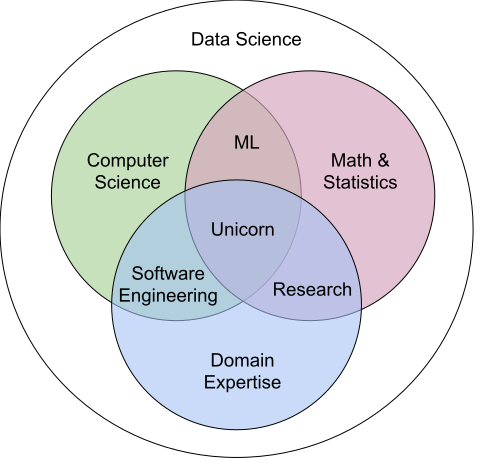
<!-- .element: class="stretch plain" -->

<!-- references_ -->
By Steven Geringer, via Ryan Orban. [Bridging the Gap Between Data Science & Engineer: Building High-Performance Teams](https://www.slideshare.net/ryanorban/bridging-the-gap-between-data-science-engineer-building-highperformance-teams/3-Software_Engineer_Data_Engineer_Data). 2016

----
## Many Role Descriptions

* Product Data Analyst (feature analysis)
* Business Intelligence, Analytics & Reporting (marketing)
* Modeling Analyst (financial forecasting)
* Machine Learning Engineer (user facing applications)
* Hybrid Data Engineer/Data Scientist (data pipelining)
* Hybrid Data Visualization Expert (communication, storytelling)
* Data Science Platforms & Tools Developer (supporting role)

<!-- references -->
e.g.  Yorgos Askalidis
. [Demystifying data science roles](https://towardsdatascience.com/what-kind-of-data-science-role-is-right-for-you-9d2f4b117e81). 2019

----
## Evolution of Data Science Roles

<!-- discussion -->

*More or less engineering focus? More or less statistics focus? ...*

----
## Software Engineering Specializations

* Architects
* Requirements engineers
* Testers
* Site reliability engineers
* Devops
* Safety
* Security
* UIX
* Distributed systems, cloud
* ...

----
## Needed Roles in Depression Prognosis Projects?

----
## Common other Roles in ML-Enabled Systems?

* **Domain specialists**
* Business, management, marketing
* Project management
* Designers, UI experts
* Operations 
* Safety, security specialist
* Big data specialist 
* Lawyers
* Social scientists, ethics
* ...

---
# Interdisciplinary Teams

----
## Unicorns -> Teams

* Domain experts
* Data scientists
* Software engineers
* Operators
* Business leaders

----
## Necessity of Groups

* Division of labor
* Division of expertise (e.g., security expert, ML expert, data cleaning expert, database expert)

----
## Team Issues Discussed Today

* Process costs
* (Groupthink)
* (Social loafing)
* Multiple/conflicting goals

---
# Team Issue: 
# Process Costs

----

# Case Studies

Disclaimer: All pictures represent abstract developer groups or products to give a sense of scale; they are not necessarily the developers of those products or developers at all.

----

## How to structure teams?

Microblogging platform; 3 friends

<!-- colstart -->
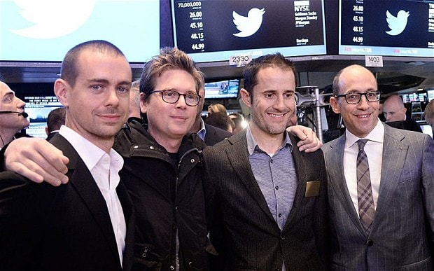
<!-- col -->

<!-- colend -->

----
## How to structure teams?

Banking app; 15 developers and data analysts

<!-- colstart -->

*(Instagram had 13 employees when they were bought for 1B in 2012)*
<!-- col -->

<!-- colend -->

----
## How to structure teams?

Mobile game; 
50ish developers?

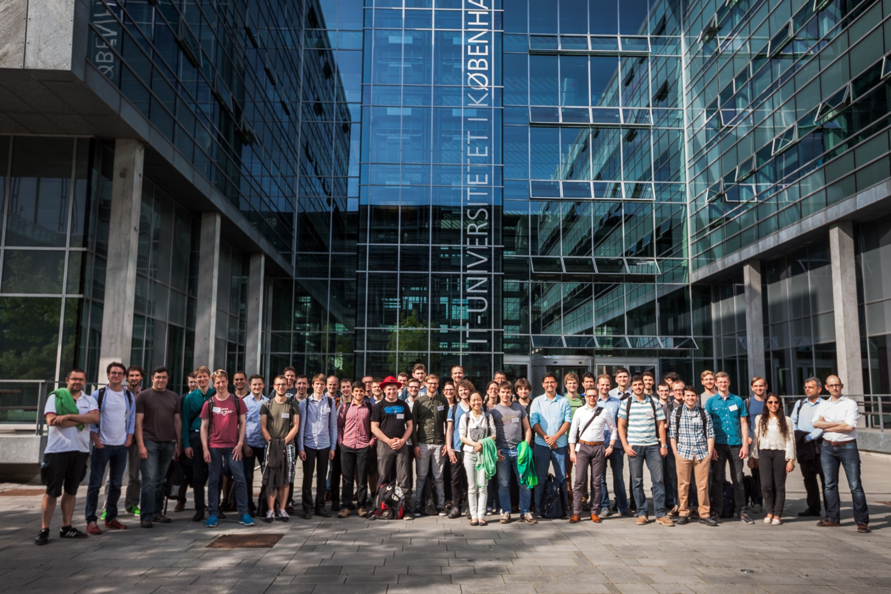
<!-- .element: class="stretch" -->

----
## How to structure teams?

Mobile game; 
200ish developers;
distributed teams?

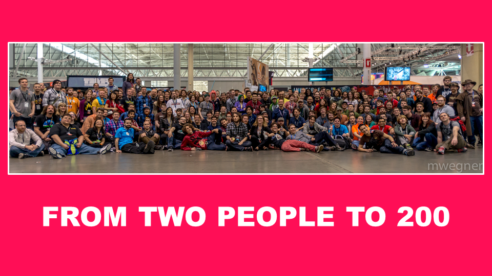

----
## How to structure teams?

Self-driving cars; 1200 developers and data analysts

<!-- colstart -->
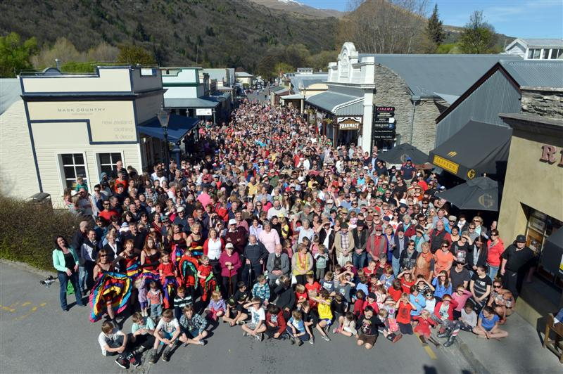
<!-- col -->
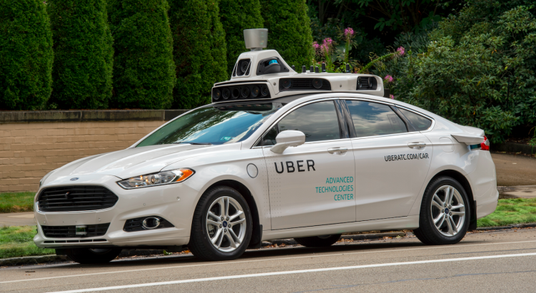
<!-- colend -->

----
## Mythical Man Month

> Brooks's law: Adding manpower to a late software project makes it later

1975, describing experience at 
IBM developing OS/360

----
## Process Costs

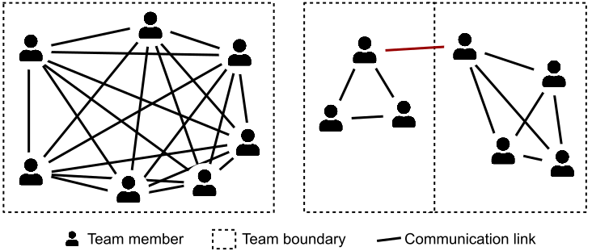
<!-- .element: class="stretch plain" -->

*n(n − 1) / 2* communication links within a team

----
## Brook's Surgical Teams

* Chief programmer – most programming and initial documentation
* Support staff
    * Copilot: supports chief programmer in development tasks, represents team at meetings
    * Administrator: manages people, hardware and other resources
    * Editor: editing documentation 
    * Two secretaries: one each for the administrator and editor
    * Program clerk: keeps records of source code and documentation
    * Toolsmith: builds specialized programming tools
    * Tester: develops and runs tests
    * Language lawyer: expert in programming languages, provides advice on producing optimal code.

<!-- references -->

Brooks. The Mythical Man-Month. 1971

Note: Would assume unicorns in today's context.

----
## Microsoft's Small Team Practices

* Vision statement and milestones (2-4 month), no formal spec
* Feature selection, prioritized by market, assigned to milestones
* Modular architecture
* Allows small federated teams (Conway's law)
* Small teams of overlapping functional specialists

(Windows 95: 200 developers and testers, one of 250 products)

----
## Microsoft's Feature Teams

* 3-8 developers (design, develop)
* 3-8 testers (validation, verification, usability, market analysis)
* 1 program manager (vision, schedule communication; leader, facilitator) – working on several features
* 1 product manager (marketing research, plan, betas)

----
## Microsoft's Process

* "Synchronize and stabilize"
* For each milestone
    * 6-10 weeks feature development and continuous testing
frequent merges, daily builds
    * 2-5 weeks integration and testing (“zero-bug release”, external betas   )
    * 2-5 weeks buffer

----
## Agile Practices (e.g., Scrum)

* 7±2 team members, collocated
* self managing
* Scrum master (potentially shared among 2-3 teams)
* Product owner / customer representative

----
## Spotify's Squads and Tribes

* Small crossfunctional teams with < 8 members
* Each squad has autonomy to decide what to build, how to build it, and how to work together -- under given Squad mission and product strategy
* Focused on regular independent releases
* Tribes are groups of squads focused on product delivery with a tribe leader (40-100 people)
* Chapters coordinate people in same role across squads

----
## Spotify's Squads and Tribes

----
> Large teams (29 people) create around six times as many defects as small teams (3 people) and obviously burn through a lot more money. Yet, the large team appears to produce about the same mount of output in only an average of 12 days’ less time. This is a truly astonishing finding, through it fits with my personal experience on projects over 35 years. - [Phillip Amour, 2006, CACM 49:9](https://dl.acm.org/citation.cfm?id=1151043)

----
## Establish communication patterns

* Avoid overhead
* Ensure reliability
* Constraint latency
* 
* e.g. Issue tracker vs email; online vs face to face

----
## Establishing Interfaces

* When dividing work, need to agree on interface
* Common source of mismatch and friction
* **Examples?**
    - Team A uses data produced by Team B
    - Team C deploys model produced by team A
    - Team D uses model and needs to provide feedback to Team A
    - Team D waits for improvement/feature from model A
*
* Ideally interfaces are stable and well documented

----
## Conway’s Law

> “Any organization that designs a system (defined broadly) will produce a design whose structure is a copy of the organization's communication structure.” — Mel Conway, 1967

> “If you have four groups working on a compiler, you'll get a 4-pass compiler.”

----
## Congurence

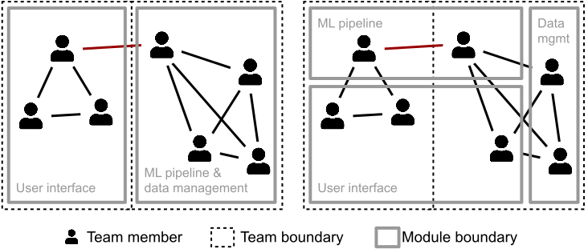
<!-- .element: class="plain stretch" -->

Structural congruence,
Geographical congruence,
Task congruence,
IRC communication congruence

----
## Leaky Abstractions for ML?

* Can one team handle data quality, model quality, fairness etc?
* What needs to be exposed at the interface?
* Can divide an conquer work if we do not yet know what the model can do?
*
* Are clear abstractions/interfaces possible?

<!-- references -->
Subramonyam, Hariharan, Jane Im, Colleen Seifert, and Eytan Adar. "Solving Separation-of-Concerns Problems in Collaborative Design of Human-AI Systems through Leaky Abstractions." In Proc. CHI 2022.

----
## The Problem with Cross-Cutting Concerns

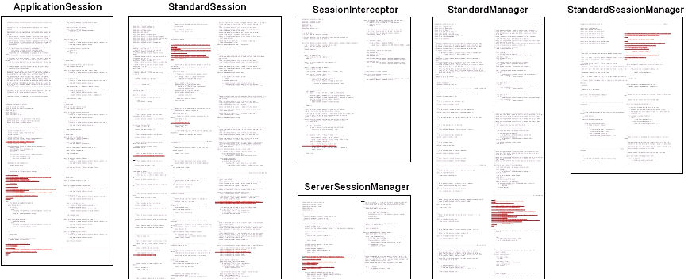<!-- .element: style="width:1400px" -->

----
## The Problem with Cross-Cutting Concerns

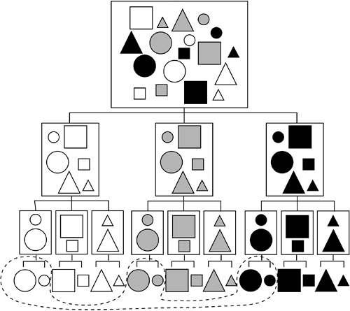<!-- .element: style="width:600px" -->

----
## Cross-Cutting Concerns

System design involves many inter-related concerns

Teams and engineering abstractions typically hierarchically organized

Forced decision: What can be abstracted in a module and what concepts need to be exposed in interface and shared/coordinated/discussed across modules

*Keep track of concerns that cannot be modularized!*

<!-- references -->

Tarr, Peri, Harold Ossher, William Harrison, and Stanley M. Sutton Jr. "N degrees of separation: Multi-dimensional separation of concerns." In Proc. ICSE. 1999.

----
## Awareness

* Notifications, meetings
* Brook's documentation book
* Email to all
* Code reviews

----
## Engineering Recommendations for Structuring ML-Enabled Systems

* Decompose the system
* Independent components (e.g. microservices)
* Isolate ML if possible
* Clear, stable interfaces, minimal coupling, documentation
* Monitoring to observe contracts and quality
* Explicitly track cross-cutting, system-level concerns like safety, fairness, security

----
## Team Structure for Transcription Service?

----
## Breakout: Team Structure for Depression Prognosis

In groups, tagging team members, discuss and post in `#lecture`:
* How to decompose the work into teams?
* What roles to recruit for the teams

---
# Story Time: Conflicts at the Interface between Teams

----
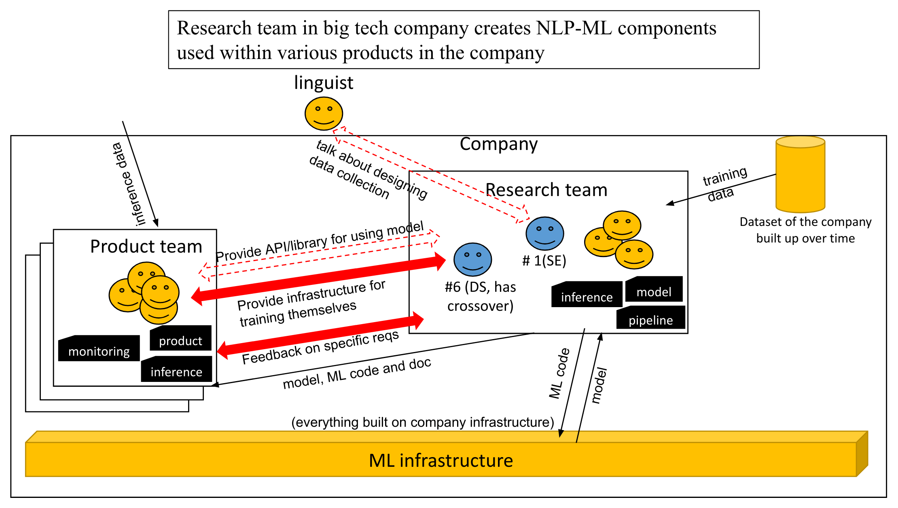
<!-- .element: class="stretch plain" -->

----
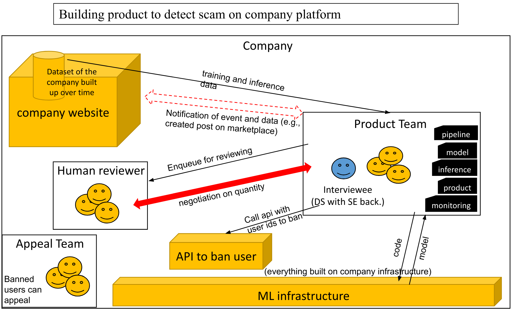
<!-- .element: class="stretch plain" -->

----
## Common Challenge: Establishing Interfaces

* Formal vs informal agreements?
* Service level agreements and automated enforcement?
* Close collaboration vs siloed teams?
* 
* Many concerns: prediction accuracy, generalization, execution time, scalability, data quality, data quantity, feedback latency, privacy, explainability, time estimation, ...
* Formal agreements and enforcement expensive, slowing development? see technical debt

----
## Common Collaboration Points

 1. Understanding system requirements and ML capabilities
 2. Understanding ML-specific requirements at the system level, reasoning about feedback loops
 3. Project planning and architecture design
 4. Data needs, data quality, data meaning
 5. Documenting model output
 6. Planning and monitoring for drift
 7. Planning ML component QA (offline, online, monitoring)
 8. Planning system QA (integration, interaction, safety, feedback loops)
 9. Tool support for data scientists 
 10. From prototype to production (pipelines, versioning, operations, user interactions, ...)

---
# Team issues: Multiple/conflicting goals

(Organization of Interdisciplinary Teams)

----
## Conflicting Goals?

<!-- .element: style="width:1000px" -->

----
## Conflicting Goals?

<svg version="1.1" viewBox="0.0 0.0 800 400" xmlns:xlink="http://www.w3.org/1999/xlink" xmlns="http://www.w3.org/2000/svg">
        
        <circle r="180" cx="250", cy="200" fill="#b9ff00" fill-opacity="0.514" />
        <circle r="180" cx="550", cy="200" fill="#ff5500" fill-opacity="0.514" />
        <text x=230 y=160 dominant-baseline="middle" text-anchor="middle">Data</text>
        <text x=230 y=240 dominant-baseline="middle" text-anchor="middle">Scientists</text>
        <text x=570 y=160 dominant-baseline="middle" text-anchor="middle">Software</text>
        <text x=570 y=240 dominant-baseline="middle" text-anchor="middle">Engineers</text>
</svg> 

----
## Conflicting Goals?

<svg version="1.1" viewBox="0.0 0.0 800 400" xmlns:xlink="http://www.w3.org/1999/xlink" xmlns="http://www.w3.org/2000/svg">
        
        <circle r="180" cx="250", cy="200" fill="#b9ff00" fill-opacity="0.514" />
        <circle r="180" cx="550", cy="200" fill="#ff0055" fill-opacity="0.514" />
        <text x=230 y=160 dominant-baseline="middle" text-anchor="middle">Data</text>
        <text x=230 y=240 dominant-baseline="middle" text-anchor="middle">Scientists</text>
        <text x=570 y=160 dominant-baseline="middle" text-anchor="middle">Compliance</text>
        <text x=570 y=240 dominant-baseline="middle" text-anchor="middle">Lawyers</text>
</svg> 

----
## Conflicting Goals?

----
## How to Address Goal Conflicts?

<!-- discussion -->

----
## T-Shaped People

*Broad-range generalist + Deep expertise*

<!-- .element: class="plain" -->

<!-- references -->
Figure: Jason Yip. [Why T-shaped people?](https://medium.com/@jchyip/why-t-shaped-people-e8706198e437). 2018

----
## T-Shaped People

*Broad-range generalist + Deep expertise*

Example:
* Basic skills of software engineering, business, distributed computing, and communication
* Deep skills in deep neural networks (technique) and medical systems (domain)

----
## Team Composition

* Cover deep expertise in all important areas
* Aim for overlap in general skills
    - Fosters communication, same language

----
## Matrix Organization

<!-- .element: class="stretch plain" -->

----
## Project Organization

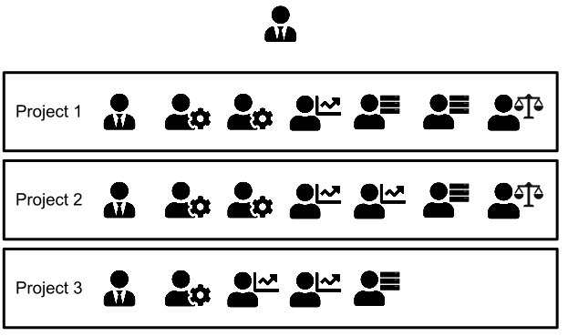
<!-- .element: class="stretch plain" -->

----
## Spotify's Squads and Tribes

----
## Case Study: Brøderbund

> As the functional departments grew, staffing the heavily matrixed projects became more and more of a nightmare. To address this, the company reorganized itself into “Studios”, each with dedicated resources for each of the major functional areas reporting up to a Studio manager. Given direct responsibility for performance and compensation, Studio managers could allocate resources freely.

> The Studios were able to exert more direct control on the projects and team members, but not without a cost. The major problem that emerged from Brøderbund’s Studio reorganization was that members of the various functional disciplines began to lose touch with their functional counterparts. Experience wasn’t shared as easily. Over time, duplicate effort began to appear.

<!-- references -->
Mantle, Mickey W., and Ron Lichty. [Managing the unmanageable: rules, tools, and insights for managing software people and teams](https://cmu.primo.exlibrisgroup.com/permalink/01CMU_INST/8lb6it/cdi_askewsholts_vlebooks_9780132981279). Addison-Wesley Professional, 2012.

----
## Specialist Allocation (Organizational Architectures)

* Centralized: development teams consult with a core group of  specialists when they need help
* Distributed: development teams hire specialists to be a first-class member of the team
* Weak Hybrid: centralized group of specialists and teams with  critical applications hire specialists
* Strong Hybrid: centralized group of specialists and most teams also hire specialists

**Tradeoffs?**

----
## Example: Security Roles

* Everyone: “security awareness” – buy into the process
* Developers: know the security capabilities of development tools and use them, know how to spot and avoid relevant, common vulnerabilities
* Managers: enable the use of security practices
* Security specialists: everything security

----
## Allocation of Data Science/Software Engineering Expertise?

----
## Commitment & Accountability

* Conflict is useful, expose all views
* Come to decision, commit to it
* Assign responsibilities
* Record decisions and commitments; make record available

----
## Bell & Hart – 8 Causes of Conflict

* Conflicting resources.
* Conflicting styles.
* Conflicting perceptions.
* Conflicting goals.
* Conflicting pressures.
* Conflicting roles.
* Different personal values.
* Unpredictable policies.

*Understanding causes helps design interventions. Examples?*

<!-- references -->
Bell, Art. (2002). [Six ways to resolve workplace conflicts](https://www.mindtools.com/pages/article/eight-causes-conflict.htm).
University of San Francisco

----
## Agile Techniques to Address Conflicting Goals?

<!-- discussion -->

---
# Recall: Team issues: Groupthink

----
## Groupthink

* Group minimizing conflict
* Avoid exploring alternatives
* Suppressing dissenting views
* Isolating from outside influences
* -> Irrational/dysfunctional decision making

----
## Experiences?

<!-- discussion -->

---
# Recall: Team issues: Social loafing

----

<!-- .element: class="stretch plain" -->

<!-- references_ -->

Latane, Bibb, Kipling Williams, and Stephen Harkins. "[Many hands make light the work: The causes and consequences of social loafing.](http://web.mit.edu/curhan/www/docs/Articles/15341_Readings/Group_Dynamics/required_reading/4Latane_et_al_1979_Many_hands_make_light_the_work.pdf)" Journal of personality and social psychology 37.6 (1979): 822.

----
## Social Loafing

* People exerting less effort within a group
* Reasons
    * Diffusion of responsibility
    * Motivation
    * Dispensability of effort / missing recognition
    * Avoid pulling everybody / "sucker effect"
    * Submaximal goal setting
* “Evaluation potential, expectations of co-worker performance, task meaningfulness, and culture had especially strong influence”

<!-- references -->

Karau, Steven J., and Kipling D. Williams. "[Social loafing: A meta-analytic review and theoretical integration](https://www1.psych.purdue.edu/~willia55/392F-%2706/KarauWilliamsMetaAnalysisJPSP.pdf)." Journal of personality and social psychology 65.4 (1993): 681.

----
## Motivation

Autonomy * Mastery * Purpose

<!-- .element: class="stretch" -->

----
## Spotify's Squads and Tribes

---
# Learning from DevOps

<!-- .element: class="stretch plain" style="width:900px" -->

----
## DevOps: A *culture* of collaboration

* Overcome historic role and goal conflicts between developers and operators
* Joint planning for operations, joint responsibilities for testing and deployment
*
* Joint goals, joint vocabulary
* Joint tools (e.g., Docker, versioning, A/B testing, monitoring)
* Mutual benefits (faster releases, more telemetry, improved reliability, fewer conflicts)
* T-shaped professionals

----
## Changing practices and culture is hard

* Ingrained "us vs them" and blame culture
* Inertia is hard to overcome (“this is how we always did things”)
* Learning cost for new concepts and tools
* Extra effort for new practices (e.g., testing)
* Overwhelmed with current tasks, no time to learn/change
* Poor adoption may cause more costs than benefits

----
## Working on Culture Change

* Bottom-up and top-down change possible
* Often introduced by individual advocates, convincing others
* Always requires supportive management
* Education helps generate buy-in
* Consultants can help with adoption and learning
* 
* Demonstrate benefits in one small project, promote from there

----
## Beyond DevOps

* Organizational culture and DevOps have been well studied
* Learn from joint goal setting, joint vocabulary, win-win-collaborations, joint tooling
*
* *What could this look like for other groups (MLOps, MLDev, SecDevOps, LawML, DataExp, SafeML, UIDev, ...)?*

<!-- discussion -->

---

# Summary

* Team dysfunctions well studied
* Know the signs, know the interventions
* Small teams, crossfunctional teams
	* Deliberately create teams, respect congruence, define interfaces
	* Hire T-shaped developers
* Create awareness and accountability

----

## Further Readings

* 🕮 Brooks Jr, Frederick P. [The mythical man-month: essays on software engineering](https://bookshop.org/books/the-mythical-man-month-essays-on-software-engineering-anniversary-edition/9780201835953). Pearson Education, 1995. 
* 🕮 DeMarco, Tom, and Tim Lister. [Peopleware: productive projects and teams](https://bookshop.org/books/peopleware-productive-projects-and-teams-revised/9780321934116). Addison-Wesley, 2013.
* 🕮 Mantle, Mickey W., and Ron Lichty. [Managing the unmanageable: rules, tools, and insights for managing software people and teams](https://www.managingtheunmanageable.net/). Addison-Wesley Professional, 2019.
* 🕮 Lencioni, Patrick. "[The five dysfunctions of a team: A Leadership Fable.](https://bookshop.org/books/the-five-dysfunctions-of-a-team-a-leadership-fable-9780787960759/9780787960759)" Jossey-Bass (2002).
* 🗎 Rakova, Bogdana, Jingying Yang, Henriette Cramer, and Rumman Chowdhury. "[Where responsible AI meets reality: Practitioner perspectives on enablers for shifting organizational practices](https://arxiv.org/abs/2006.12358)." Proceedings of the ACM on Human-Computer Interaction 5, no. CSCW1 (2021): 1-23.
* 🗎 Luz, Welder Pinheiro, Gustavo Pinto, and Rodrigo Bonifácio. "[Adopting DevOps in the real world: A theory, a model, and a case study](http://gustavopinto.org/lost+found/jss2019.pdf)." Journal of Systems and Software 157 (2019): 110384.
* 🗎 Sambasivan, Nithya, Shivani Kapania, Hannah Highfill, Diana Akrong, Praveen Paritosh, and Lora M. Aroyo. "[“Everyone wants to do the model work, not the data work”: Data Cascades in High-Stakes AI](https://research.google/pubs/pub49953/)". In Proceedings of the 2021 CHI Conference on Human Factors in Computing Systems, pp. 1-15. 2021.

